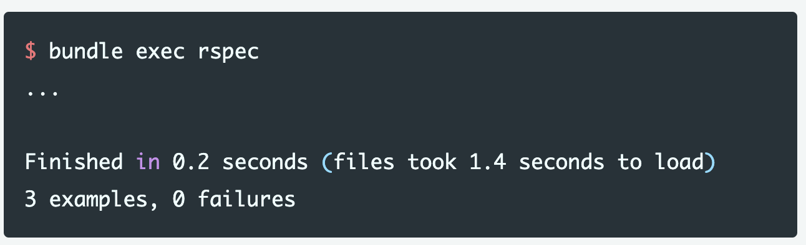

# 1. 入门指南

### 指南设想

这是指南可以帮助你去开发一个Sequent应用，并不认为你之前有任何对Sequent的使用经验。

Sequent使用的设计模式来自于DDD(领域驱动设计)，像CQRS和Event Sourcing。需要对这些基本的原则有所了解，但不需要你成为这方面的专家，有关这方面的信息，我们可能会参考指南中的一些DDD资源。

### Sequent是什么？

Sequent 是一个用于 Ruby 的 CQRS 和 Event Sourcing 框架，它能使你去捕获所有应用状态的更改为一系列事件，而不仅仅是就存当前状态。这个将有以下一些优势：

* 事件旅行可以穿梭回任何之前的状态，例如 用于调试。
* 免费获得可审计性和可追踪性。
* 回填新的表或者字段通过重现存在的事件。
* 易于与其他利益相关者推理事件（通用语言）。

要阅读其中的一些概念，我推荐 Martin Fowler 的 wiki:

* [CQRS (Command Query Responsibility Segregati](https://martinfowler.com/bliki/CQRS.html)
* [Event Sourcing](https://martinfowler.com/eaaDev/EventSourcing.html)
* [Ubiquitous Language](https://martinfowler.com/bliki/UbiquitousLanguage.html)

### 创建一个新的 Sequent 项目

一步步跟着是最好的方式来阅读指南。所有的步骤都是重要去运行这个例子，没有需要多余的代码或者步骤。

遵循本指南，你可以创建一个简单的 Sequent 项目，在你开始构建应用之前，你需要确保Sequent已经被安装好。

### 安装 Sequent

在你安装 Sequent 之前，你需要去检查确保你的系统有恰当的预置安装程序，包括：Ruby 和 PostgreSQL

### Ruby

验证你当前安装的Ruby

Sequent 需要 Ruby 2.7.0 以后的版本，假如你的Ruby版本太低，你需要升级你的Ruby版本。我们推荐使用 rbenv 来管理 Ruby版本。

### Postgres

你也需要安装 PostgresSQL 数据库，验证你当前安装的 PostgreSQL 的版本。

.png>)

Sequent 需要 PostgreSQL 9.4以后的版本才能工作，但我们推荐你安装最新的版本。有关安装说明，请参考你的操作系统或者查看 postgresql.org。
